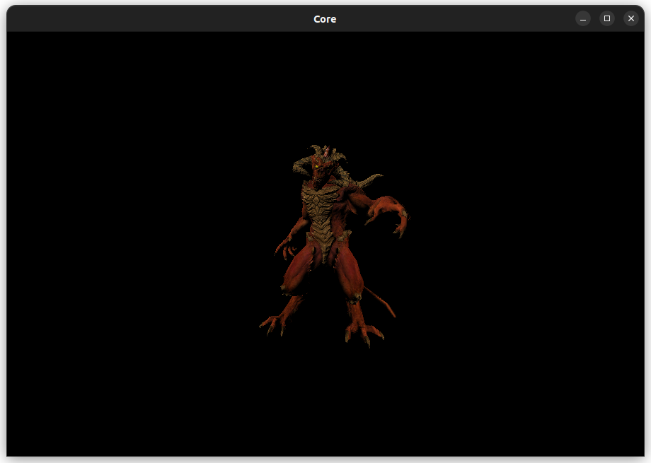

# SoftRenderer
 A simple renderer without graphic api like Vulkan, DirectX and OpenGL. 
 
## Dependency
SDL2 for create window and draw point.
In linux platform, you can install the package through commands below.
```bash
sudo apt-get install libsdl2-dev
```
## Build
You need cmake and c++ compiler. After having those tools. You can run commands below to build this project. Current only test on linux, if you want to build this on windows or other platform, you need change some settings in CMakeLists.txt.

``` bash
 mkdir build
 cd build
 cmake ..
```

## ScreenShot

